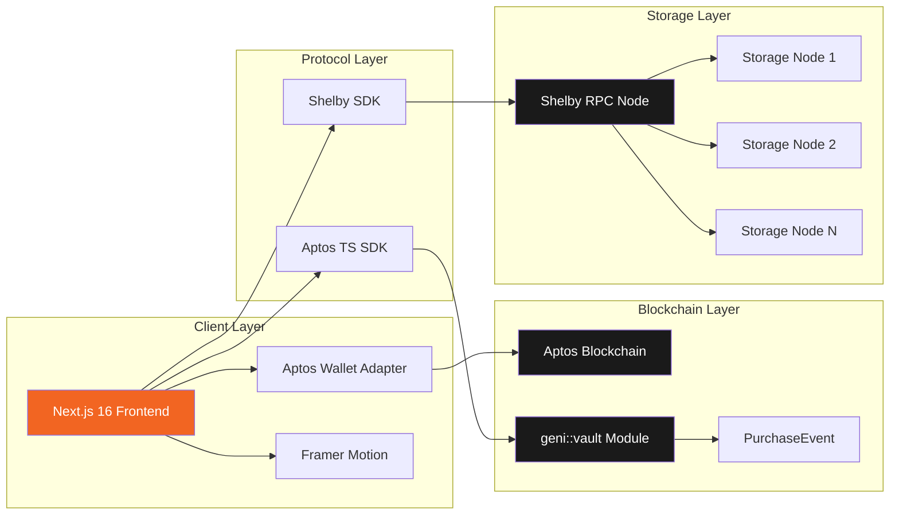
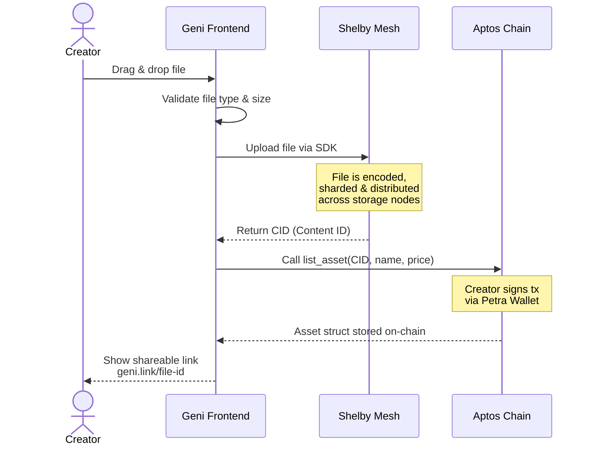
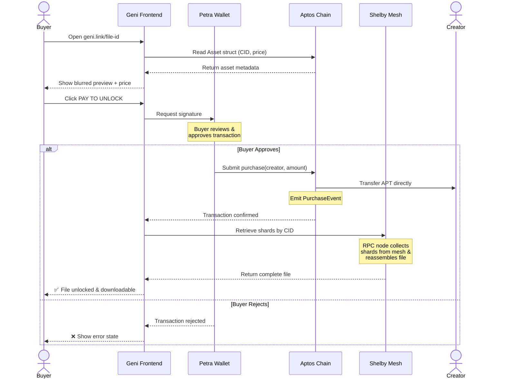
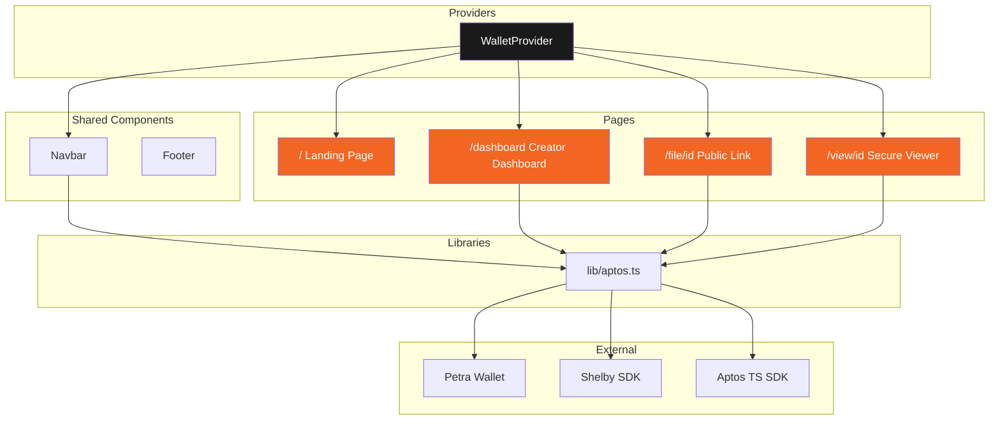

<p align="center">
  
  
  
  
  
</p>

<h1 align="center">GENI</h1>
<h3 align="center">The Fire-Fast Asset Vault</h3>
<p align="center"><em>A minimalist pay-to-unlock gateway for high-value files.<br/>Upload. Price. Sell. — No backend. No middleman.</em></p>

<p align="center">https://geni-puce.vercel.app/</p>
---

## What is Geni?

**Geni** is a decentralized file monetization protocol built on [Aptos](https://aptos.dev) and [Shelby Protocol](https://shelby.xyz). Creators can upload any file, set a price in APT, and share a unique link. Buyers pay directly — peer-to-peer — and unlock the file instantly from the Shelby decentralized mesh.

> **Zero infrastructure cost.** The blockchain IS the backend.

---

## Architecture

```mermaid
graph TB
    subgraph Creator Flow
        A[📁 Creator uploads file] --> B[Shelby Mesh Network]
        B --> C[Returns CID]
        C --> D[list_asset on Aptos]
        D --> E[CID + Price stored on-chain]
        E --> F[🔗 Shareable Link generated]
    end

    subgraph Buyer Flow
        G[🛒 Buyer opens link] --> H[Sees blurred preview + price]
        H --> I[Clicks PAY TO UNLOCK]
        I --> J[Petra Wallet signs tx]
        J --> K[APT transferred to Creator]
        K --> L[purchase event emitted]
        L --> M[Frontend fetches from Shelby]
        M --> N[✅ File unlocked & downloadable]
    end

    style A fill:#F26522,color:#fff
    style N fill:#22C55E,color:#fff
    style D fill:#1A1A1A,color:#fff
    style K fill:#1A1A1A,color:#fff
```



### System Architecture



---

## Tech Stack

| Layer | Technology | Purpose |
|:---|:---|:---|
| **Frontend** | Next.js 16 + Tailwind CSS 4 | App Router, SSR, brutalist UI |
| **Animations** | Framer Motion | Page transitions, micro-interactions |
| **Storage** | Shelby Protocol SDK | Decentralized hot-storage mesh |
| **Payments** | Aptos Blockchain | Direct peer-to-peer APT transfers |
| **Auth** | Aptos Wallet Adapter | Petra wallet integration |
| **Smart Contract** | Move Language | On-chain asset registry & payments |

---

## Transaction Flow

### Upload & Listing Sequence



### Purchase & Unlock Sequence



### Component Architecture



---

## Project Structure

```
geni/
├── src/
│   ├── app/
│   │   ├── page.tsx              # Landing page
│   │   ├── layout.tsx            # Root layout + providers
│   │   ├── globals.css           # Brutalist design system
│   │   ├── dashboard/
│   │   │   └── page.tsx          # Creator dashboard
│   │   ├── file/[id]/
│   │   │   └── page.tsx          # Public link + pay-to-unlock
│   │   └── view/[id]/
│   │       └── page.tsx          # Secure viewer + download
│   ├── components/
│   │   ├── Navbar.tsx            # Navigation + wallet connect
│   │   └── Footer.tsx            # Footer with pill nav
│   ├── providers/
│   │   └── WalletProvider.tsx    # Aptos wallet adapter
│   └── lib/
│       └── aptos.ts              # Utilities + mock data
├── contract/
│   ├── Move.toml                 # Move project config
│   └── sources/
│       └── vault.move            # On-chain asset registry
├── package.json
├── tailwind.config.ts
└── tsconfig.json
```

---

## Quick Start

### Prerequisites

- **Node.js** 18+
- **npm** or **yarn**
- [**Petra Wallet**](https://petra.app/) browser extension (for wallet features)

### Installation

```bash
# Clone the repository
git clone https://github.com/your-username/geni.git
cd geni

# Install dependencies
npm install

# Start development server
npm run dev
```

Open [http://localhost:3000](http://localhost:3000) to see the app.

### Deploy Smart Contract (Optional)

```bash
# Install Aptos CLI
# https://aptos.dev/tools/aptos-cli/

# Initialize Aptos account
cd contract
aptos init --network testnet

# Fund your account
aptos account fund-with-faucet --account default

# Publish the module
aptos move publish --named-addresses geni=default
```

---

## Pages

### 🏠 Landing Page (`/`)
Brutalist hero with "UPLOAD. PRICE. SELL." typography, bento feature grid, stats section, and step-by-step flow.

### 📊 Creator Dashboard (`/dashboard`)
Drag-and-drop file upload, APT price input, real-time upload progress (Shelby sharding simulation), and listed assets table.

### 🔗 Public Link (`/file/[id]`)
Blurred content preview, asset metadata, multi-step purchase flow with wallet signing and on-chain confirmation.

### 🔓 Secure Viewer (`/view/[id]`)
Terminal-style shard retrieval animation, progress tracking, and secure file download.

---

## Smart Contract

The `geni::vault` Move module provides two entry functions:

```move
/// Creator lists an asset with CID and price
public entry fun list_asset(
    creator: &signer,
    cid: vector<u8>,
    name: String,
    price: u64,  // in Octas
)

/// Buyer purchases — APT transferred directly to creator
public entry fun purchase(
    buyer: &signer,
    creator_addr: address,
    amount: u64,
) acquires Asset
```

Events are emitted on purchase for frontend tracking. No intermediary fees.

---

## Design Philosophy

- **Brutalist UI** — Monospace typography (Geist Mono), industrial aesthetic, `#F26522` orange accents
- **Zero Backend** — All state lives on-chain. The frontend reads directly from the blockchain
- **Peer-to-Peer** — No custodial wallets. APT flows directly from buyer to creator
- **Mesh Storage** — Files are sharded across the Shelby decentralized network, not centralized servers

---

## Roadmap

- [ ] Full Shelby SDK integration (mainnet)
- [ ] Multi-file asset bundles
- [ ] On-chain access control (NFT-gated viewing)
- [ ] Creator analytics dashboard
- [ ] Revenue splitting for collaborators
- [ ] IPFS fallback storage
- [ ] Mobile-optimized viewer

---

## License

MIT © [Geni Protocol](https://github.com/your-username/geni)

---

<p align="center">
  <strong>Built with 🔥 on Aptos</strong><br/>
  <sub>Shelby Protocol • Move Smart Contracts • Next.js 16</sub>
</p>
